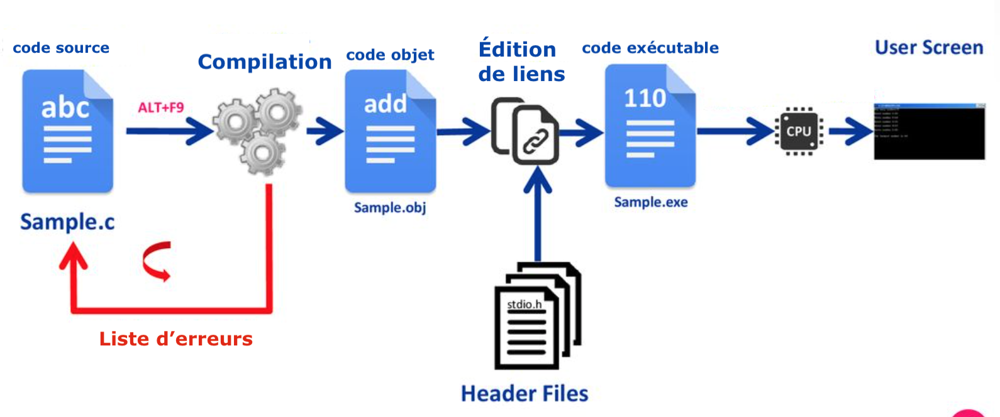
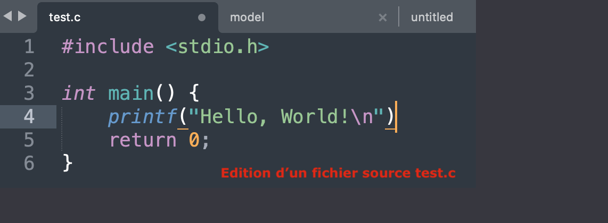

# Environnement de développement & compilation d'un programme.
## Présentation du cycle de développement d'un programme en langage C

Le développement d'un programme en langage C se fait en quatre étapes principales : 

1. Création du fichier de code source.
2. Compilation du code source en code objet.
3. Liaison d'une bibliothèque pour créer un fichier programme.
4. Exécution du programme pour le tester.

Chacune de ces étapes est essentielle et nécessite une attention particulière. Maintenant, explorons-les plus en détail.




### Édition du code source

Le code source en langage C est du texte brut. Ce qui distingue un fichier de code source C d'un simple fichier texte est l'extension de nom de fichier `.c` ; tous les fichiers de code source C utilisent cette extension de nom de fichier. À titre de comparaison, le code Python utilise l'extension `.py`.

Pour rédiger votre code source, vous devez utiliser un éditeur de texte. De nombreux éditeurs de texte peuvent faire l'affaire, mais les meilleurs proposent des fonctionnalités supplémentaires comme la coloration syntaxique, la recherche de motifs, etc., qui peuvent faciliter le processus d'écriture du code.

### Compilation, liaison, construction

Après avoir rédigé le code source, la prochaine étape consiste à construire le programme. Ce processus comprend deux sous-étapes : la compilation et l'édition de liens.

La compilation est effectuée par un compilateur, qui est un programme informatique qui transforme le code source écrit par le programmeur en code objet. Un **compilateur** est donc un outil qui traduit le code source de l'ordinateur, écrit dans un langage de programmation de haut niveau, en un langage de bas niveau que la machine peut exécuter directement. 

Lorsque vous compilez un fichier de code source, le compilateur lit le texte du fichier de code source, l'analyse, et produit en sortie un fichier de code objet. Ce fichier de code objet a généralement une extension `.o` ou `.obj`.

Tout élément de votre code source qui provoque une erreur ou un avertissement sera signalé par le compilateur. Une erreur arrête le processus de compilation, tandis qu'un avertissement peut ou non empêcher la création d'un code objet.

Après la compilation, le code objet est ensuite lié ou combiné avec le fichier de bibliothèque C pour construire le programme final. Ce processus est appelé édition de liens. Tout comme la compilation, si des erreurs sont détectées lors de l'édition de liens, le processus est interrompu.

De nos jours, la compilation et l'édition de liens sont souvent combinées en une seule étape appelée construction. Cependant, il est important de noter que la compilation et l'édition de liens ont toujours lieu, qu'elles soient effectuées séparément ou ensemble.

### Exécution du programme

Enfin, une fois que le programme a été construit sans erreur ni avertissement, il peut être exécuté pour être testé. Si le programme ne fonctionne pas comme prévu, il est courant de revenir à l'étape de l'édition du code source pour apporter des modifications, puis de répéter les étapes de la compilation, de l'édition de liens et de l'exécution jusqu'à ce que le programme fonctionne correctement.

Ainsi, le processus de développement d'un programme en C implique un cycle


continu d'édition, de compilation, de liaison et d'exécution, qui est souvent répété plusieurs fois jusqu'à ce que le programme fonctionne comme prévu.

Pour la petite histoire, le compilateur C original d'Unix s'appelait cc, qui signifie simplement "C compiler". L'éditeur de liens original d'Unix s'appelait ld, qui pourrait signifier "link editor". Le programme ld existe toujours sur Linux et d'autres systèmes similaires à Unix. Il est généralement appelé en interne par le compilateur.

En somme, le développement d'un programme en C est un processus impliquant plusieurs étapes distinctes, chacune ayant son importance. En comprenant bien ce processus, vous serez mieux à même de développer des programmes efficaces et de résoudre les problèmes qui pourraient survenir.

## Mise au point sur la compilation

Compiler est le processus qui transforme le code source écrit par les programmeurs en instructions que l'ordinateur peut comprendre. Le code source est généralement écrit dans un langage de haut niveau, comme le C. La compilation convertit ce code en langage de bas niveau (code machine) qui peut être exécuté directement par l'ordinateur.

Le compilateur est donc un programme qui lit le code source et le traduit en un format exécutable. En cas d'erreur dans le code source, le compilateur affiche des messages d'erreur, ce qui aide les programmeurs à corriger leur code.

Voici un exemple simple de la façon de compiler un programme en C à l'aide du compilateur GCC :

Supposons que nous ayons un fichier `hello.c` qui contient le code source suivant :

```c
#include <stdio.h>

int main() {
    printf("Hello, World!\n");
    return 0;
}
```

Ce programme est un exemple très simple qui affiche simplement le message "Hello, World!" à l'utilisateur.

Pour compiler ce programme, nous devons utiliser le compilateur GCC. Vous pouvez le faire en ouvrant une fenêtre de terminal (ou une invite de commande), en naviguant jusqu'au répertoire contenant votre fichier `hello.c`, et en exécutant la commande suivante :

```bash
gcc hello.c -o hello
```

Ici, `gcc` est le compilateur que nous utilisons (GCC signifie GNU Compiler Collection). `hello.c` est le nom du fichier source que nous compilons. `-o hello` signifie "output to `hello`", ce qui indique au compilateur de créer un fichier exécutable nommé `hello`.

Si le programme est compilé avec succès, vous ne verrez aucune sortie et vous obtiendrez simplement une nouvelle invite de commande. Si vous listez maintenant les fichiers dans votre répertoire (avec la commande `ls` sur Unix/Linux/macOS ou `dir` sur Windows), vous devriez voir un nouveau fichier appelé `hello` (ou `hello.exe` sur Windows).

Vous pouvez exécuter le programme compilé en tapant `./hello` dans votre terminal (ou simplement `hello` sur Windows).

Si votre code source contient des erreurs, le compilateur vous donnera des messages d'erreur lorsque vous tenterez de le compiler. Ces messages peuvent vous aider à identifier et à corriger les problèmes dans votre code.




## Configuration de l'éditeur de texte ( Visual Studio Code)

Visual Studio Code (VS Code) est un éditeur de code-source populaire développé par Microsoft. Il est très léger comparé à d'autres environnements de développement intégrés (IDE), mais il peut être étendu avec diverses extensions pour supporter un large éventail de langages de programmation, dont le C.

Voici les étapes pour installer et configurer VS Code pour compiler du code C sur un PC Windows :

**Étape 1 : Installer Visual Studio Code**

1. Allez sur le site de Visual Studio Code (https://code.visualstudio.com/) et téléchargez la dernière version pour Windows.
2. Ouvrez le fichier .exe téléchargé et suivez les instructions pour installer Visual Studio Code sur votre PC.

**Étape 2 : Installer le compilateur GCC**

Pour compiler du code C, vous aurez besoin d'un compilateur. GCC (GNU Compiler Collection) est un compilateur populaire pour le C et d'autres langages. Vous pouvez l'installer en utilisant un environnement comme MinGW.

1. Allez sur le site de MinGW (https://osdn.net/projects/mingw/releases/).
2. Téléchargez la dernière version de MinGW et installez-la sur votre PC.
3. Ajoutez MinGW à votre variable d'environnement PATH :
   - Ouvrez le Panneau de configuration > Système et sécurité > Système > Paramètres système avancés.
   - Cliquez sur Variables d'environnement.
   - Sous Variables système, recherchez la variable PATH, puis cliquez sur Modifier.
   - Ajoutez le chemin d'accès où vous avez installé MinGW (par exemple, `C:\MinGW\bin`) à la fin de la variable d'environnement PATH.

**Étape 3 : Installer l'extension C/C++ pour Visual Studio Code**

1. Ouvrez Visual Studio Code.
2. Cliquez sur l'icône Extensions (qui ressemble à des carrés empilés) dans la barre d'outils de gauche.
3. Dans la barre de recherche des Extensions, tapez `c++` et installez l'extension "C/C++" de Microsoft.

**Étape 4 : Configurer l'extension C/C++ pour utiliser GCC**

1. Ouvrez Visual Studio Code.
2. Créez un nouveau fichier avec l'extension .c (par exemple, `test.c`).
3. Ouvrez ce fichier dans Visual Studio Code. L'extension C/C++ devrait automatiquement détecter que vous travaillez avec du code C.
4. Cliquez sur le bouton "Go Live" en bas à droite ou sur "View > Command Palette" et tapez `C/C++: Edit Configurations (UI)`.
5. Une nouvelle fenêtre s'ouvrira. Dans le champ "Compiler path", entrez le chemin complet vers votre compilateur GCC (par exemple, `C:\MinGW\bin\gcc.exe`).
6. Enregistrez les modifications et fermez la fenêtre.

Maintenant, vous devriez être prêt à compiler et à exécuter du code C dans Visual Studio Code. Pour compiler un fichier C, ouvrez le Terminal dans VS Code (View > Terminal) et tapez `gcc nom_du_fichier.c -o nom_du_fichier`, puis appuyez sur Entrée. Vous pouvez ensuite exécuter le fichier compilé avec `./nom_du_fichier`.

Notez que vous devez remplacer `nom_du_fichier` par le nom de votre fichier source. Par exemple, si vous avez un fichier `test.c`, vous pouvez le compiler avec `gcc test.c -o test` et l'exécuter avec `./test`.

**Étape 5 : Créer un fichier de tâches pour la compilation automatique**

Pour automatiser le processus de compilation, vous pouvez créer un fichier de tâches dans Visual Studio Code.

1. Ouvrez Visual Studio Code et accédez à "Terminal" > "Configure Default Build Task".
2. Choisissez "Create tasks.json file from template", puis "Others".
3. Remplacez le contenu du fichier par le suivant :

    ```json
    {
        "version": "2.0.0",
        "tasks": [
            {
                "label": "build",
                "type": "shell",
                "command": "gcc",
                "args": [
                    "-g",
                    "${file}",
                    "-o",
                    "${fileDirname}/${fileBasenameNoExtension}"
                ],
                "options": {
                    "cwd": "${workspaceFolder}"
                },
                "problemMatcher": [
                    "$gcc"
                ],
                "group": {
                    "kind": "build",
                    "isDefault": true
                }
            }
        ]
    }
    ```

4. Enregistrez le fichier et fermez-le.

Maintenant, vous pouvez compiler automatiquement votre fichier C en utilisant "Terminal" > "Run Build Task" (ou en utilisant le raccourci clavier Ctrl+Shift+B).

**Étape 6 : Déboguer votre code C**

VS Code offre également un débogueur intégré. Pour l'utiliser, vous devez d'abord configurer le fichier `launch.json`.

1. Allez à "Run" > "Add Configuration...".
2. Choisissez "C++ (GDB/LLDB)".
3. Choisissez "g++.exe - Build and debug active file" (ceci est pour les fichiers C++ mais cela fonctionne aussi pour les fichiers C).
4. Enregistrez le fichier `launch.json` généré et fermez-le.

Maintenant, vous pouvez déboguer votre fichier C en utilisant "Run" > "Start Debugging" (ou en utilisant le raccourci clavier F5).

Notez que le chemin du compilateur GCC (`g++.exe` ou `gcc.exe`) et le chemin du débogueur (`gdb.exe`) doivent être correctement configurés dans les fichiers `tasks.json` et `launch.json`. Si vous avez installé MinGW dans un autre dossier, assurez-vous de mettre à jour ces chemins en conséquence.

## Rappel et manipulation des chaînes de caractères

Les chaînes de caractères en C sont des tableaux de caractères se terminant par le caractère nul (`\0`). Elles sont essentielles dans tous les programmes pour stocker et manipuler du texte.
Ces tableaux peuvent être statiques (taille fixée à la compilation) ou dynamiques (taille déterminée à l'exécution).

Voici un exemple de chaque type :

- Tableau statique :
    ```c
    char maChaine[20] = "Bonjour";
    ```

- Tableau dynamique :
    ```c
    char *maChaine = malloc(20 * sizeof(char));
    strcpy(maChaine, "Bonjour");
    ```
    
Dans le cas d'un tableau dynamique, on utilise la fonction `malloc` pour allouer de la mémoire, et `strcpy` pour copier la chaîne "Bonjour" dans le tableau.

### Fonctions de la bibliothèque standard 

La bibliothèque standard C offre plusieurs fonctions pour manipuler les chaînes de caractères. Celles-ci sont déclarées dans l'en-tête `<string.h>`. Voici quelques-unes des fonctions les plus couramment utilisées :

- `strlen(s)`: Cette fonction prend en argument une chaîne de caractères s et renvoie sa longueur, c'est-à-dire le nombre de caractères avant le caractère nul (`\0`) qui marque la fin de la chaîne. Par exemple, `strlen("Bonjour")` renvoie 7.
    ```c
    char *mot = "Bonjour";
    printf("%lu\n", strlen(mot));  // Affiche: 7
    ```

- `strcpy(s1, s2)`: Cette fonction copie la chaîne s2 dans la chaîne s1. Il faut veiller à ce que s1 ait suffisamment d'espace pour contenir s2, sinon il peut y avoir un débordement de mémoire.
    ```c
    char *s1 = malloc(20 * sizeof(char));
    char *s2 = "Bonjour";
    strcpy(s1, s2);
    printf("%s\n", s1);  // Affiche: Bonjour
    ```

- `strcat(s1, s2)`: Cette fonction concatène la chaîne s2 à la fin de la chaîne s1. Encore une fois, il faut veiller à ce que s1 ait suffisamment d'espace pour contenir la chaîne résultante.
    ```c
    char *s1 = malloc(30 * sizeof(char));
    char *s2 = "Bonjour";
    strcpy(s1, "Hello, ");
    strcat(s1, s2);
    printf("%s\n", s1);  // Affiche: Hello, Bonjour
    ```

- `strcmp(s1, s2)`: Cette fonction compare les chaînes s1 et s2. Elle renvoie 0 si s1 et s2 sont identiques, un nombre négatif si s1 est inférieure à s2 (selon l'ordre lexicographique), et un nombre positif si s1 est supérieure à s2.
    ```c
    char *s1 = "Bonjour";
    char *s2 = "Bonsoir";
    printf("%d\n", strcmp(s1, s2));  // Affiche: un nombre négatif
    ```

Dans cet exemple, `strcmp(s1, s2)` renvoie un nombre négatif car "Bonjour" est inférieur à "Bonsoir" dans l'ordre lexicographique.

Il est important de noter que toutes ces fonctions supposent que les chaînes de caractères sont correctement terminées par un caractère nul (`\0`). Si ce n'est pas le cas, ces fonctions peuvent conduire à un comportement indéfini, comme l'accès à des zones de mémoire non allouées.

Lors de l'utilisation des fonctions `strcpy` et `strcat`, il faut s'assurer que la chaîne de destination a suffisamment d'espace pour contenir le résultat. Si ce n'est pas le cas, ces fonctions peuvent écrire au-delà de l'espace alloué, ce qui est une autre source de comportement indéfini.

Enfin, lorsqu'on travaille avec des chaînes de caractères allouées dynamiquement (avec malloc, par exemple), il ne faut pas oublier de libérer la mémoire une fois qu'on a fini de les utiliser.


### L'inverse d'une chaîne

Écrire un programme qui prend une chaîne de caractères entrée par l'utilisateur, puis crée une nouvelle chaîne qui est l'inverse de la chaîne originale.

1. S'assurer un espace de travail prêt à l'emploi avec un main fonctionnel et l'inclusion des bibliothèques propres à la manipulation des chaînes.


2. Commencez par allouer de la mémoire pour deux chaînes de caractères, original et inverse. Pour l'instant, nous ne savons pas combien de caractères l'utilisateur va entrer, donc allouez une taille raisonnable, par exemple 100 caractères.

```c
char *original = malloc(100 * sizeof(char));
char *inverse = malloc(100 * sizeof(char));

```

3. Demandez à l'utilisateur d'entrer une chaîne et stockez-la dans original.


4. Déclarez une variable len de type int pour stocker la longueur de la chaîne original.

5. Utilisez la fonction strlen pour obtenir la longueur de la chaîne original et assignez-la à la variable len.


6. Utilisez une boucle for pour parcourir les indices de 0 à len - 1. 


7. Déclarez une variable i de type int et initialisez-la à 0. La condition de la boucle sera i < len. À chaque itération, incrémente i de 1.


8. À l'intérieur de la boucle, assignez à inverse[i] le caractère correspondant à l'indice inversé len - 1 - i de la chaîne original.


9. Après la boucle, assurez-vous de terminer la chaîne inverse en ajoutant un caractère nul ('\0') à la position len du tableau inverse. Cela indique la fin de la chaîne.

10. Affichez inverse.

11. Libérez la mémoire allouée à original et inverse.
```c
free(original);
free(inverse);
```


### À vous de jouer 🤠

Nous allons créer un programme qui demande à l'utilisateur de saisir deux mots de passe, puis vérifie si ces deux mots de passe sont identiques. Si c'est le cas, le programme doit afficher un message indiquant que les mots de passe sont identiques. Sinon, il doit afficher un message indiquant qu'ils sont différents et afficher la longueur de chaque mot de passe.

1. S'assurer un espace de travail prêt à l'emploi avec un main fonctionnel et l'inclusion des bibliothèques propres à la manipulation des chaînes.

2. Déclarez deux pointeurs de caractères pour stocker les mots de passe. Utilisez malloc pour allouer de l'espace mémoire pour chaque pointeur.

3. Demandez à l'utilisateur d'entrer le premier mot de passe en affichant un message approprié.

4. Utilisez scanf pour lire et stocker le premier mot de passe dans le premier pointeur.

5. Demandez à l'utilisateur d'entrer le deuxième mot de passe en affichant un message approprié.

6. Utilisez scanf pour lire et stocker le deuxième mot de passe dans le deuxième pointeur.

7. Comparez les deux mots de passe en utilisant la fonction strcmp . Si la valeur retournée est égale à zéro, affichez un message indiquant que les mots de passe sont identiques. Sinon, affichez un message indiquant qu'ils sont différents.

8. Utilisez la fonction strlen de la bibliothèque string.h pour obtenir la longueur de chaque mot de passe.

9. Affichez la longueur du premier mot de passe et du deuxième mot de passe en utilisant des messages appropriés.

10. N'oubliez pas de libérer la mémoire allouée en utilisant la fonction free pour chaque pointeur.


## Stratégies de mots de passe

### Importance des mots de passe sécurisés

De nos jours, la plupart de nos informations sont stockées en ligne, que ce soit nos coordonnées bancaires, nos courriels personnels, nos photos ou nos documents de travail. C'est pourquoi il est essentiel de protéger ces informations avec des mots de passe sécurisés.

Un mot de passe sécurisé empêche les attaquants de deviner ou de craquer votre mot de passe en utilisant des techniques comme la force brute (tester toutes les combinaisons possibles) ou l'attaque par dictionnaire (tester des mots courants ou des phrases).

### Caractéristiques des mots de passe robustes

Un mot de passe robuste doit :

1. **Être long** : Plus un mot de passe est long, plus il sera difficile à craquer. Un mot de passe d'au moins 12 caractères est recommandé.

2. **Utiliser une variété de caractères** : Cela inclut des lettres majuscules et minuscules, des chiffres et des symboles.

3. **Être unique** : N'utilisez pas le même mot de passe pour plusieurs comptes. Si un compte est compromis, les autres seront en sécurité.

4. Ne pas contenir d'informations personnelles évidentes : Évitez d'utiliser des noms, des dates de naissance ou d'autres informations qui pourraient être facilement devinées par quelqu'un qui vous connaît.

### Exemple d'un mot de passe faible et d'un mot de passe fort

Faible : `password123`
Fort : `!2aZ%Lo$8&Yb#`


### À vous de jouer 🤠

1. S'assurer un espace de travail prêt à l'emploi avec un main fonctionnel et l'inclusion des bibliothèques propres à la manipulation des chaînes.

2. Initialiser le générateur de nombres aléatoires : Utilisez `srand(time(0));` pour initialiser le générateur de nombres aléatoires. Cela garantit que vous obtiendrez une série de nombres différents chaque fois que vous exécutez le programme.

3. Créer un tableau pour le mot de passe : Déclarez un tableau de caractères pour stocker le mot de passe. Dans cet exemple, nous utilisons `char password[9];` pour un mot de passe de 8 caractères plus le caractère nul de fin de chaîne.

4. Générer les caractères du mot de passe : Utilisez une boucle for pour générer chaque caractère du mot de passe. Pour chaque caractère, générez un nombre aléatoire avec `rand() % 62;`. Ce nombre est utilisé pour déterminer quel caractère ajouter au mot de passe.

5. Ajouter le caractère au mot de passe : Utilisez une structure conditionnelle if pour déterminer quel caractère ajouter au mot de passe en fonction du nombre aléatoire généré. Si le nombre est inférieur à 10, ajoutez un chiffre. Si le nombre est inférieur à 36, ajoutez une lettre majuscule. Sinon, ajoutez une lettre minuscule.

6. Terminer le mot de passe : Après la boucle for, ajoutez un caractère nul à la fin du mot de passe avec `password[8] = '\0';`. Cela marque la fin de la chaîne de caractères.

7. Afficher le mot de passe : Utilisez `printf` pour afficher le mot de passe généré.


### Utilisation de la fonction rand() pour générer des caractères aléatoires

La fonction `rand()` est une fonction de la bibliothèque standard C qui génère un nombre entier pseudo-aléatoire dans l'intervalle de `0` à `RAND_MAX` (qui est généralement défini comme une valeur assez grande, comme `32767` ou `2147483647`). Chaque fois que vous appelez `rand()`, vous obtenez le prochain nombre dans une série. Pour démarrer cette série à un point différent à chaque exécution du programme, vous pouvez appeler `srand(time(0));` une fois au début du programme. La fonction `srand` initialise le générateur de nombres aléatoires avec une graine, dans ce cas l'heure actuelle, convertie en secondes.

Pour générer un nombre dans une plage spécifique, vous pouvez utiliser l'opérateur modulo (`%`). Par exemple, `rand() % 62` génère un nombre entre `0` et `61`. C'est ce qui est utilisé dans le générateur de mots de passe pour choisir un caractère aléatoire à partir d'une plage de `62` caractères possibles (26 lettres majuscules, 26 lettres minuscules et 10 chiffres).

### Exercice : Améliorer le générateur pour inclure des caractères spéciaux et des chiffres

Maintenant, nous allons améliorer le générateur de mots de passe pour inclure des caractères spéciaux  et une taille de mots de passe de longueur variable. Voici les étapes que vous pouvez suivre :

Je suis ravi de vous aider à développer un générateur de mots de passe complexe. Suivez les instructions ci-dessous :


1. Demandez à l'utilisateur combien de caractères il souhaite pour son mot de passe. Stockez cette information dans une variable, par exemple `longueur`.


2. Créez un tableau pour stocker le mot de passe. Assurez-vous que sa taille est suffisante pour accueillir tous les caractères du mot de passe plus le caractère de fin de chaîne (`\0`).


3. Créez une chaîne qui contient tous les caractères que vous voulez utiliser dans le mot de passe. Vous pouvez inclure des lettres minuscules, des lettres majuscules, des chiffres et des caractères spéciaux.

```c
    char caracteres[] = "abcdefghijklmnopqrstuvwxyzABCDEFGHIJKLMNOPQRSTUVWXYZ0123456789!@#$%^&*()";
    int numCaracteres = sizeof(caracteres) - 1;
```


4. Utilisez une boucle `for` pour générer chaque caractère du mot de passe. À chaque itération, choisissez un caractère aléatoire de la chaîne `caracteres` et ajoutez-le au mot de passe.

```c
    for (int i = 0; i < longeur; i++) {
        password[i] = caracteres[rand() % numCaracteres];
    }
```

5. Ajoutez un caractère nul à la fin du mot de passe pour indiquer où il se termine.


6. Affichez le mot de passe généré.

En suivant ces étapes, vous devriez être capable de créer un générateur de mots de passe complexe qui crée des mots de passe de longueur variable avec un mélange de lettres, de chiffres et de caractères spéciaux.